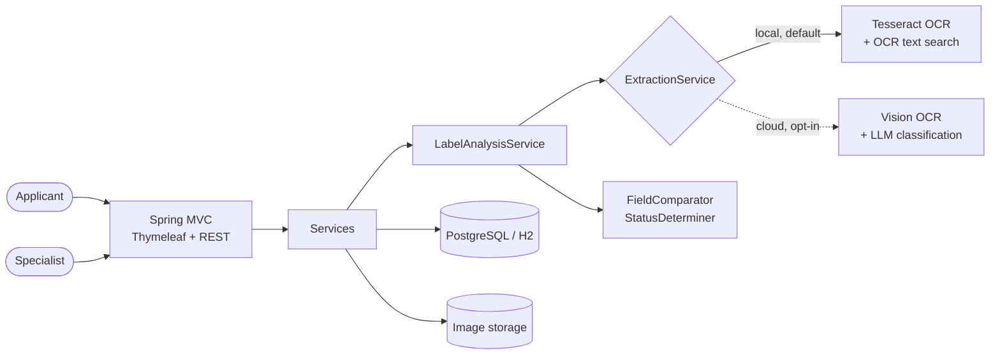

# TTB Label Verification

AI-assisted compliance review of alcohol beverage labels for TTB (Alcohol and Tobacco Tax and Trade Bureau) labeling specialists.

Applicants upload label images with their COLA application data (TTB Form 5100.31). The service reads the label with OCR, compares every regulated field with what was declared, and proposes a verdict. A specialist then approves, reviews field by field, or sets the final status with a written justification. Every decision is audited.

**Local-first.** It runs entirely on-host with Tesseract OCR and no API keys. An optional cloud pipeline (Google Cloud Vision + OpenAI) adds bounding-box overlays and image-type classification.

## Production demo: how to sign in

**Live site:** https://alclabelverification-production.up.railway.app/login

> [!IMPORTANT]
> **You do not need to type a password.** Pick a demo account from the **Email** dropdown and the password fills in automatically.
>
> 1. Open the login page and **click the Email field**. A **Demo accounts** list opens.
> 2. **Select a user.** Each entry shows initials, name, email and a **Specialist** or **Applicant** badge. You can type part of a name or email to filter, and use ↑ / ↓ and Enter to choose.
> 3. The **email and password load automatically**. The password appears as masked dots.
> 4. **Sign in** is highlighted and focused, so just **press Enter** or click it.

| Account | Role | Company | Use it to |
|---------|------|---------|-----------|
| Specialist Two · `specialist2@example.gov` | Specialist | — | Review queues, batch approve, override, settings |
| Specialist Three · `specialist3@example.gov` | Specialist | — | Same as above (second reviewer) |
| Applicant Two · `applicant2@example.com` | Applicant | Aldercrest Distilling Co. | Submit labels, see own results |
| Applicant Three · `applicant3@example.com` | Applicant | Quillmoor Cellars | Submit labels, see own results |
| Applicant Four · `applicant4@example.com` | Applicant | Tidewater Row Brewing Co. | Submit labels, see own results |
| Applicant Five · `applicant5@example.com` | Applicant | Northvale Spirits | Submit labels, see own results |

> [!NOTE]
> - The filled-in password is a random placeholder, not the account's real password. The server stores only password hashes, so no real password is ever sent to the browser.
> - If you edit the email or password after picking an account, the form switches back to a normal password check, and you then need the real password.
> - Without JavaScript, a plain **Demo account** selector with a **Sign in as selected** button appears instead.

> [!WARNING]
> Demo mode lets **anyone who can reach the site** sign in as these accounts. It is turned on with `APP_DEMO_LOGIN=true` (off by default), and every startup logs a warning while it is on. Turn it off for any real use. See [docs/user-accounts.md](docs/user-accounts.md#demo-mode-pick-an-account-on-the-login-page).

**Suggested walkthrough:**

1. **As an applicant** (for example Applicant Two), open **New submission** and choose a label image from [test-labels/](test-labels/). The form fills itself from the label in under a second. Check the values and submit.
2. **Sign out, then sign in as a specialist** (for example Specialist Two). Compliant labels are under **Ready to approve**, and flawed ones under **Needs review**, each with the AI recommendation and field-by-field findings.

## What's new

| Change | Details |
|--------|---------|
| **Login page redesign** | Dark background, gold-edged card, shield logo. The Email field doubles as the demo-account dropdown (see above), and **Sign in** shows a spinner while signing in. |
| **Sessions survive restarts** | HTTP sessions are stored in the database (Spring Session JDBC, Flyway `V3__http_sessions.sql`). Restarts and Railway sleep/wake no longer sign users out. |
| **Stricter health-warning check** | The warning matches only when the `GOVERNMENT WARNING:` landmark and **all six** key body phrases are legible. A label missing clause (2) is now **Rejected**; before, it could be approved. A title-case prefix is caught even when OCR misreads a letter. |
| **No more near-miss matches** | A partly matching value is compared as it reads on the label, not taken as the declared value. For example, "…Distillery, Portland, Maine" no longer matches a declared "…Distillery, Austin, Texas". |
| **Numbers match whole values only** | A declared `5%` is no longer found inside a label's `4.5%`. Alcohol content differing by **0.5 points or more** is a mismatch. `1L` on a label matches a declared `1 L`. |
| **Production sample run** | 34 synthetic labels were run through the live site: clean, degraded (rotated, blurred, heavy JPEG, 640 px, noisy, low-contrast, light-on-dark) and deliberately flawed. OCR read every image in 0.5–0.9 s. The run exposed the matching bugs above, and after the fixes **33 of 34** got the expected verdict. The remaining one follows a documented rule (see [Known limitations](#known-limitations)). |

## Quick start

### Zero setup (in-memory database)

Requires Java 21 and Tesseract 5.

```bash
brew install tesseract
```

```bash
./mvnw spring-boot:run -Dspring-boot.run.profiles=demo
```

Open http://localhost:8080. On first start the log shows the two bootstrap accounts and a generated password. To choose the password yourself, set `APP_SEED_PASSWORD` before starting.

### With PostgreSQL

```bash
cp .env.example .env
```

Fill in `DATABASE_USERNAME`, `DATABASE_PASSWORD` and `APP_SEED_PASSWORD` in `.env`, then:

```bash
docker compose up -d postgres
```

```bash
set -a && source .env && set +a && ./mvnw spring-boot:run
```

Flyway creates the schema. On an empty database the app creates one specialist, one applicant company with its user, and default settings. No labels are seeded: every label goes through the real pipeline.

### Try it

[test-labels/](test-labels/) contains synthetic labels (fictional brands) with their application data, including one deliberately non-compliant label.

1. Sign in as the applicant and open **New submission**.
2. Choose `test-labels/aldercrest-bourbon/front.png`. The label is read immediately, and the form is **pre-filled**: type of product, capacity, brand, class/type, alcohol content, net contents, qualifying phrase, name and address, and age statement.
3. Check the highlighted values against the application (`application.json`), then submit.
4. Sign in as the specialist. The label is under **Ready to approve**.

## How it works

1. **Submit.** The applicant chooses label images, and the form is pre-filled from the label text for them to confirm against their application. They submit through the web form, the REST API, or a CSV batch of up to 50 rows.
2. **Analyze.** OCR reads the label, each declared field is located and compared, and the label moves to *Pending review* with an **AI-proposed status** and a confidence score, in about a second.
3. **Decide.** The specialist works two queues:
   - **Ready to approve:** the AI proposes approval, every field matches, and confidence is at or above the threshold (default 90%). These can be batch-approved.
   - **Needs review:** resolve individual fields (match / mismatch / not found) and the status is re-derived, or set the final status directly with a justification.

### Verdict rules

| Outcome | When | Correction window |
|---------|------|-------------------|
| **Rejected** | Health warning missing, incomplete (any clause absent), wrong, or its `GOVERNMENT WARNING:` prefix not in capitals (always checked against the statutory text); or illegal container size | — |
| **Needs correction** | A mandatory field is missing or mismatched | 30 days |
| **Conditionally approved** | Only minor fields (brand, fanciful name, appellation, varietal) or optional fields differ | 7 days |
| **Approved** | Everything matches | — |

Expired deadlines downgrade automatically the next time a label is read. No scheduler is needed.

### Field comparison

| Field | Strategy | Example |
|-------|----------|---------|
| Health warning, vintage year | Exact | Whitespace-normalized; prefix must be capitals; all six key phrases must be legible |
| Brand, class/type, name and address | Fuzzy | `STONE'S THROW` = `Stone's Throw`; `…Portland, Maine` ≠ `…Austin, Texas` |
| Alcohol content | Numeric | `45% Alc./Vol. (90 Proof)` = `45%`; `40%` ≠ `42%`; `6.0%` ≠ `5.5%`; `5%` ≠ `4.5%` |
| Net contents | Numeric | `750 mL` = `75 cL` = `0.75 L`; `1L` = `1 L` |
| Age statement | Numeric | `Aged 6 years` = `6 Years Old` |
| Country of origin | Contains | `Product of Scotland` ⊇ `Scotland` |
| Qualifying phrase | Enumerated | `BOTTLED BY` = `Bottled by`; `Bottled by` ≠ `Distilled by` |

Measured on the bundled samples with local OCR: the three compliant labels are proposed **Approved**, with every field matched in about 0.5–0.8 s each. The flawed label is proposed **Rejected**, flagging the wrong ABV and the title-case warning prefix. On a wider set of 34 synthetic labels, 33 got the expected verdict (see [What's new](#whats-new)). Details are in [docs/ai-pipelines.md](docs/ai-pipelines.md).

### Deploy to Railway

The repository includes `railway.json` and a `railway` Spring profile sized for a 512 MB container. Measured peak memory is 402 MB. The setup is two services: the app from the `Dockerfile`, and PostgreSQL. See [docs/deploy-railway.md](docs/deploy-railway.md) for the free-plan fit, variables, steps and verification.

## Architecture at a glance



| Topic | Where |
|-------|-------|
| Components, flows, state machine, data model, security | [docs/architecture.md](docs/architecture.md) |
| Local, container and production infrastructure; network zones; CI/CD | [docs/infrastructure.md](docs/infrastructure.md) |
| Why it's built this way (20 ADRs) | [docs/adr/](docs/adr/README.md) |
| Deploying on Railway (free / Hobby plan) | [docs/deploy-railway.md](docs/deploy-railway.md) |
| Diagram sources (15 Mermaid files) | [docs/diagrams/](docs/diagrams/README.md) |

## Stack

| Layer | Technology |
|-------|------------|
| Runtime | Java 21 (virtual threads) |
| Framework | Spring Boot 3.5: Web MVC, Data JPA, Security, Validation, Actuator |
| UI | Thymeleaf, server-rendered, one stylesheet; JavaScript only for convenience |
| Database | PostgreSQL 17 (H2 for demo and tests), Flyway migrations |
| Sessions | Spring Session JDBC (stored in the database) |
| OCR | Tesseract 5 via Tess4J (local); Google Cloud Vision REST (cloud) |
| Classification | OpenAI Chat Completions with strict JSON schema (cloud) |
| Testing | JUnit 5, AssertJ, Spring MockMvc, spring-security-test (117 tests, incl. real-OCR end-to-end) |

## Project layout

```
.
├── pom.xml, mvnw                  Maven build (wrapper included)
├── Dockerfile, docker-compose.yml Container image and local infrastructure
├── railway.json                   Railway build/deploy configuration
├── .env.example                   Every configuration variable (no values for secrets)
├── scripts/
│   ├── ci.sh                      Vendor-neutral CI entry point
│   └── SampleLabelGenerator.java  Regenerates the synthetic sample labels
├── docs/                          Architecture, infrastructure, ADRs, pipelines, API, flows
├── test-labels/                   Synthetic labels + application data + batch CSV
└── src/
    ├── main/java/gov/ttb/labelverification/
    │   ├── regulatory/            TTB rules as code
    │   ├── labels/                Verdict, deadlines, lazy status recovery
    │   ├── ai/                    local/, cloud/, ocr/, compare/, prefill/
    │   ├── domain/ repository/    JPA entities and repositories
    │   ├── storage/               Image storage and validation
    │   ├── service/               Use cases
    │   ├── security/ config/      Security, properties, bootstrap
    │   └── web/                   page/ (Thymeleaf) and api/ (REST)
    ├── main/resources/            Flyway migrations, templates, static assets
    └── test/                      Unit and integration tests
```

Package details are in [src/main/java/gov/ttb/labelverification/README.md](src/main/java/gov/ttb/labelverification/README.md).

## Commands

```bash
./mvnw test
```

```bash
./scripts/ci.sh
```

```bash
./mvnw package && java -jar target/label-verification-0.1.0-SNAPSHOT.jar
```

```bash
docker compose --profile app up --build
```

```bash
java scripts/SampleLabelGenerator.java test-labels
```

## Configuration

All variables are listed in [.env.example](.env.example). No credential has a default value.

| Variable | Purpose |
|----------|---------|
| `DATABASE_URL`, `DATABASE_USERNAME`, `DATABASE_PASSWORD` | PostgreSQL connection |
| `APP_SEED`, `APP_SEED_PASSWORD` | Bootstrap accounts on an empty database; set `APP_SEED=false` in production |
| `APP_USERS` | Additional specialists and applicants as JSON, with bcrypt hashes preferred ([docs/user-accounts.md](docs/user-accounts.md)) |
| `APP_SEED_SPECIALIST_EMAIL`, `APP_SEED_APPLICANT_EMAIL` | Bootstrap account emails (defaults use `example.gov` / `example.com`) |
| `APP_DEMO_LOGIN`, `APP_DEMO_LOGIN_ACCOUNTS` | Demo-account dropdown on the login page, with no password needed (off by default; demos only) |
| `TESSDATA_PREFIX`, `TESSERACT_LIBRARY_PATH` | Tesseract locations, when auto-detection fails |
| `GOOGLE_VISION_API_KEY` + `OPENAI_API_KEY` | Enable the cloud pipeline (both required) |
| `OPENAI_MODEL` | Classification model |
| `APP_STORAGE_TYPE`, `APP_STORAGE_DIR` | Image storage: `filesystem` (default, directory) or `database` |
| `SPRING_PROFILES_ACTIVE=railway` | Small-container profile (database images, one OCR at a time, HTTPS proxy) |
| `OCR_MAX_CONCURRENT`, `DB_POOL_SIZE`, `TOMCAT_MAX_THREADS`, `JAVA_OPTS` | Sizing |

Runtime settings (pipeline, approval threshold, SLA targets) are edited by specialists at **/settings** or `PUT /api/v1/settings`.

## REST API

Stateless HTTP Basic. Full reference in [docs/api.md](docs/api.md).

| Method | Path | Role |
|--------|------|------|
| GET | `/api/v1/labels?queue=ready\|review\|all` | any (scoped) |
| GET | `/api/v1/labels/{id}` | any (scoped) |
| POST | `/api/v1/labels/extract` (multipart) — pre-fill suggestions | applicant |
| POST | `/api/v1/labels` (multipart) | applicant |
| POST | `/api/v1/labels/{id}/review` | specialist |
| POST | `/api/v1/labels/{id}/override` | specialist |
| POST | `/api/v1/labels/{id}/reanalyze` | specialist |
| POST | `/api/v1/labels/batch-approve` | specialist |
| GET | `/api/v1/images/{id}` | any (scoped) |
| GET/PUT | `/api/v1/settings` | specialist |

## Known limitations

- **Image resolution.** Local OCR needs legible small print, roughly 1000 px or wider for a full label. On low-resolution photos the health warning may be unreadable, so the label is proposed *Rejected* and the specialist resolves that field after checking the image. Because all six key warning phrases must now be legible, badly blurred real photos go to review more often. That is the intended trade-off: a false rejection can be corrected by a specialist, but a false approval would not be noticed.
- **Optional fields missing from the label are ignored.** If an applicant declares an optional field (for example a fanciful name) and it is not on the label at all, the verdict is unaffected. A declared value that differs from what is on the label is still flagged.
- Pre-fill is rule-based in local mode. It works on clearly printed labels; on decorative or low-resolution labels some fields may stay empty and must be typed.
- Bounding-box overlays and image-type classification require the cloud pipeline, which has not been exercised against live services in this repository.
- Field-strictness settings are stored and displayed, but not yet applied to comparison thresholds.
- Analysis runs inside the submit request (60 s timeout). The queue-based design is in [docs/infrastructure.md](docs/infrastructure.md#6-scaling-target).

## Documentation

| Document | Contents |
|----------|----------|
| [docs/architecture.md](docs/architecture.md) | Internal design with diagrams |
| [docs/infrastructure.md](docs/infrastructure.md) | Deployment topologies, network zones, CI/CD, secrets, sizing |
| [docs/deploy-railway.md](docs/deploy-railway.md) | Railway deployment guide and measured memory |
| [docs/adr/](docs/adr/README.md) | Architecture decision records |
| [docs/ai-pipelines.md](docs/ai-pipelines.md) | OCR, field search, comparison engine, measured results |
| [docs/performance.md](docs/performance.md) | Image processing times, performance matrix, concurrency, resolution and memory (local benchmark) |
| [docs/api.md](docs/api.md) | REST reference |
| [docs/user-accounts.md](docs/user-accounts.md) | Creating specialist and applicant accounts |
| [docs/user-flows.md](docs/user-flows.md) | Applicant and specialist workflows, edge cases |
| [docs/test-scenarios.md](docs/test-scenarios.md) | 146 test scenarios with automated, live and production evidence |
| [docs/production.md](docs/production.md) | Production-readiness checklist and roadmap |
