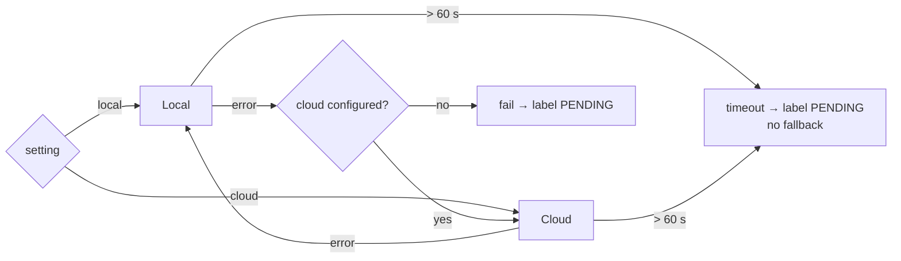

# AI Pipelines

How TTB Label Verification reads a label, finds each regulated field, and decides whether it matches the application.

```
             Stage 1                Stage 2                     Stage 3              Compare
Images ──▶  OCR        ──▶  find / classify fields  ──▶  bounding boxes  ──▶  FieldComparator ──▶ StatusDeterminer
```

| | **Local** (default) | **Cloud** (opt-in) |
|---|---|---|
| Stage 1 | Tesseract 5 via Tess4J, on-host | Google Cloud Vision `TEXT_DETECTION` (REST) |
| Stage 2 | `OcrTextSearch`: find each *expected* value in the OCR text | OpenAI Chat Completions, strict JSON schema |
| Stage 3 | — (no word geometry) | `BoundingBoxMath`: union of classified words' boxes |
| Needs | `libtesseract` + `eng.traineddata` | `GOOGLE_VISION_API_KEY` **and** `OPENAI_API_KEY` |
| Bounding-box overlays | No | Yes |
| Image-type classification | No | Yes (front/back/neck/strip, applied at ≥ 60% confidence) |
| Typical latency | ~0.5–0.8 s per label (measured on the synthetic samples) | ~2–5 s |
| Cost per label | $0 | about $0.003–0.004 (Vision about $0.0015/image, plus a small LLM call) |
| `model_used` | `tesseract-local` | `google-vision+<openai-model>` |

## Pipeline selection and fallback

`ExtractionService` reads `settings.submission_pipeline_model` (`local` by default; specialists change it at `/settings`):



- Each run is bounded by `app.pipeline.timeout` (default 60 s) and executed on a virtual thread.
- A timeout does **not** trigger the fallback. Running a second pipeline would double the wait.
- `model_used` on the stored result always shows which pipeline actually ran.

## Local pipeline

**`ai/ocr/TesseractOcrEngine`**

1. The image is decoded with `ImageIO` (JPEG and PNG; WebP needs the cloud pipeline).
2. It is converted to grayscale, and images narrower than 1024 px are upscaled to 2048 px (bicubic).
3. Two Tesseract passes run (LSTM engine):
   - `PSM 11` (sparse text) for scattered, decorative front-label text
   - `PSM 6` (single block) for dense back-label text such as the health warning
4. Lines from both passes are merged, and case-insensitive duplicates are removed.

Library and tessdata paths are auto-detected (Homebrew, `/usr/local`, Debian/Ubuntu) or set with `TESSERACT_LIBRARY_PATH` / `TESSDATA_PREFIX`. If tessdata isn't found, the local pipeline reports itself unavailable and the Settings page says so.

**`ai/compare/OcrTextSearch`**: with no LLM, the local pipeline searches the OCR text for each value the applicant declared. It tries these strategies in order:

| # | Strategy | Handles |
|---|----------|---------|
| 1 | Case-insensitive substring | Clean text |
| 2 | Substring after stripping `. , ' -` | OCR dropping punctuation (`STONES THROW`) |
| 3 | **Landmark**: fuzzy `GOVERNMENT WARNING` prefix, **plus ≥ 4 of 6** key body phrases (surgeon general, pregnancy, birth defects, drive a car, operate machinery, health problems) | Garbled small print, without accepting a legible prefix over an illegible body |
| 4 | Sliding word window, Dice similarity | Minor OCR noise. A score ≥ 0.75 returns the expected value verbatim — **except numeric fields**, which return the OCR text (see below). |
| 5 | Scattered words: every word of 3+ letters found somewhere (exact, or Dice ≥ 0.75). Skipped for numeric fields. | Decorative labels with one word per line (`ALDER … CREST`) |
| — | Otherwise, the best window with a score ≥ 0.6, else `null` | |

**Numeric fields keep the OCR text** ([ADR-0012](adr/0012-numeric-fields-keep-ocr-text-warning-prefix-must-be-capitals.md)). For alcohol content, net contents, age statement and vintage year, a one-character difference is the violation (`40%` vs `42%`). Search therefore returns what the label actually says, and the numeric comparator decides.

## Form pre-fill

When an applicant chooses images, `PrefillService` suggests form values. Nothing is stored.

- **Local:** `TesseractOcrEngine.recognizeLines` runs automatic layout analysis (PSM 3), returning each text line with its pixel height. `ai/prefill/LabelFieldExtractor` then claims lines in this order:
  1. health-warning block (never suggested to the form)
  2. patterns: alcohol content, net contents (plus container size in mL, with 12 FL OZ mapped to 355), age statement, country of origin
  3. qualifying phrase (the longest known phrase; `&` is read as "and"), then name and address from the rest of that line or the next line
  4. class/type: the line with the highest share of class vocabulary, which needs a core word such as *whiskey* or *lager*
  5. wine details: vintage year, appellation (the rest of the vintage line), sulfite declaration, varietal
  6. brand: the tallest remaining line
  7. fanciful name: an unclaimed line between the brand and the class/type

  Beverage type comes from `BeverageDetector` keywords. With several images, the front image wins and the others only fill gaps.
- **Cloud** (when selected and configured): the cloud pipeline runs without declared values, and its fields are returned. On failure it falls back to local.

Measured on the synthetic labels: every printed field was recovered (10 of 10 on the bourbon, 12 of 12 on the chardonnay) in 0.3–0.6 s.

Because pre-filled values come from the label itself, verification only means something once the applicant confirms them against the approved application. The health warning is therefore never pre-filled, and it is always compared with the statutory text ([ADR-0017](adr/0017-health-warning-verified-against-statutory-text-pre-fill-is-a-suggestion.md)).

## Cloud pipeline

**Stage 1: `GoogleVisionOcrEngine`.** It runs one REST call per image, all in parallel on virtual threads. `textAnnotations[0]` is the full text and the rest are words with 4-vertex polygons (reduced to axis-aligned boxes). Page size comes from `fullTextAnnotation.pages[0]`, or from decoding the image when absent.

**Stage 2: `OpenAiFieldClassifier`.**
- Input: an indexed word list (`index|image|text`), the beverage type with its mandatory and optional fields (27 CFR Part), and the applicant's declared values. Declared values are used only to disambiguate; the model is told to report what the label actually says.
- Output: `response_format: json_schema` with `strict: true`. Every property is required, and nullables are typed `["string","null"]`:
  ```json
  { "fields": [{ "fieldName": "brand_name", "value": "ALDERCREST", "confidence": 97,
                 "reasoning": "…", "wordIndices": [0, 1] }],
    "imageClassifications": [{ "imageIndex": 0, "imageType": "front", "confidence": 92 }],
    "detectedBeverageType": "DISTILLED_SPIRITS" }
  ```
- Text only (no image tokens), `temperature: 0`. Token usage is stored on the validation result.

**Stage 3: `BoundingBoxMath`.** Each field's word indices are mapped back to Vision word boxes on the first word's image. The union box is normalized to 0–1, and the reading angle is estimated (90° when most words are tall and narrow). The boxes come from Vision, not the LLM, so they are pixel-accurate.

## Comparison engine

`ai/compare/FieldComparator` is pure and stateless. Each `FieldName` carries its `MatchStrategy`:

| Strategy | Fields | Rule | Match confidence |
|----------|--------|------|------------------|
| EXACT | health warning, vintage year, standards of fill | Whitespace-normalized equality. Vintage: digits equal. Health warning: case-insensitive equality is accepted **only if the `GOVERNMENT WARNING:` prefix is in capitals** (27 CFR 16.22), otherwise mismatch; or Dice ≥ 0.9 for OCR noise | 100 / 95 / 85 / sim×80 |
| FUZZY | brand, fanciful name, class/type, name & address, varietal, appellation, sulfites, state of distillation | Dice coefficient on character bigrams ≥ 0.8, else containment either way | sim×100 / ratio×85 |
| NORMALIZED | alcohol content | Parse `%` or `proof ÷ 2`; tolerance ±0.5 | 100 exact / 90 |
| NORMALIZED | net contents | Convert mL, cL, L, fl oz, pt, qt, gal to mL; tolerance ±1% | 100 / 90 |
| NORMALIZED | age statement | `N years` / `aged N` → integer years | 100 |
| CONTAINS | country of origin | Containment either way, else ≥ 50% word overlap | 90 / overlap×80 |
| ENUM | qualifying phrase | Both sides map to the same known phrase; different known phrases → mismatch; else fuzzy | 95 |

Rules applied on top:

- **Missing value** → `NOT_FOUND`, confidence 0.
- **Match floor:** any `MATCH` is raised to at least 95 confidence, so correct matches found by a weak strategy don't drag a label out of *Ready to approve*.
- **Accepted variants** (the `accepted_variants` table) are checked first: a whitelisted canonical/variant pair is an immediate `MATCH` (95).
- **Minor fields:** a `MISMATCH` on brand, fanciful name, appellation, or varietal is stored as `NEEDS_CORRECTION`.

**Overall confidence** is the rounded mean of the field confidences.

## Expected fields

`labels/ExpectedFields` builds the comparison set: every field the applicant filled in, plus the **health warning, always as the statutory text** of 27 CFR Part 16 (`regulatory/HealthWarning.FULL_TEXT`). Any health-warning text the applicant supplies is stored but never used as the reference.

## From field results to a verdict

`labels/StatusDeterminer`, in order:

1. Container size is not a legal standard of fill for spirits or wine → **REJECTED**. Malt beverages have no size list, and review-time recalculation skips this check.
2. Health warning mismatched or not found → **REJECTED**.
3. A mandatory field is mismatched or not found → **NEEDS_CORRECTION** (30 days).
4. A minor or optional field is mismatched → **CONDITIONALLY_APPROVED** (7 days).
5. Otherwise → **APPROVED**.

An optional field that is *not found* does not affect the verdict. Mandatory fields per type are defined in `regulatory/BeverageType`.

## Measured behavior (local pipeline)

Run through the application against the synthetic labels in `test-labels/` (1600×2000 px PNG, one image each):

| Label | AI proposal | Fields matched | Time |
|-------|-------------|----------------|------|
| Aldercrest bourbon | Approved (99%) | 9 / 9 | 0.79 s |
| Quillmoor Cellars chardonnay | Approved (99%) | 8 / 8 | 0.56 s |
| Tidewater Row lager | Approved (99%) | 8 / 8 | 0.53 s |
| Northvale vodka (deliberately flawed) | Rejected (97%) | 5 / 7 | 0.52 s |

The flawed label is caught for exactly its two planted defects: alcohol content (label 40%, application 42%) and a health-warning prefix that is not in capitals.

Resolution matters. On images around 500 px wide, Tesseract still reads large text but not health-warning small print; those labels are proposed *Rejected* until a specialist resolves the field. Use photos of about 1000 px or wider, or the cloud pipeline.

## Extending

- **Another OCR engine or LLM:** implement `OcrEngine` or `ExtractionPipeline` and register it in `ExtractionService`.
- **A new field:** add it to `FieldName` (with its strategy), `ApplicationData.valueOf`, the migration, and the form.
- **A regulatory change:** edit `regulatory/*`. Business logic reads everything from there.
