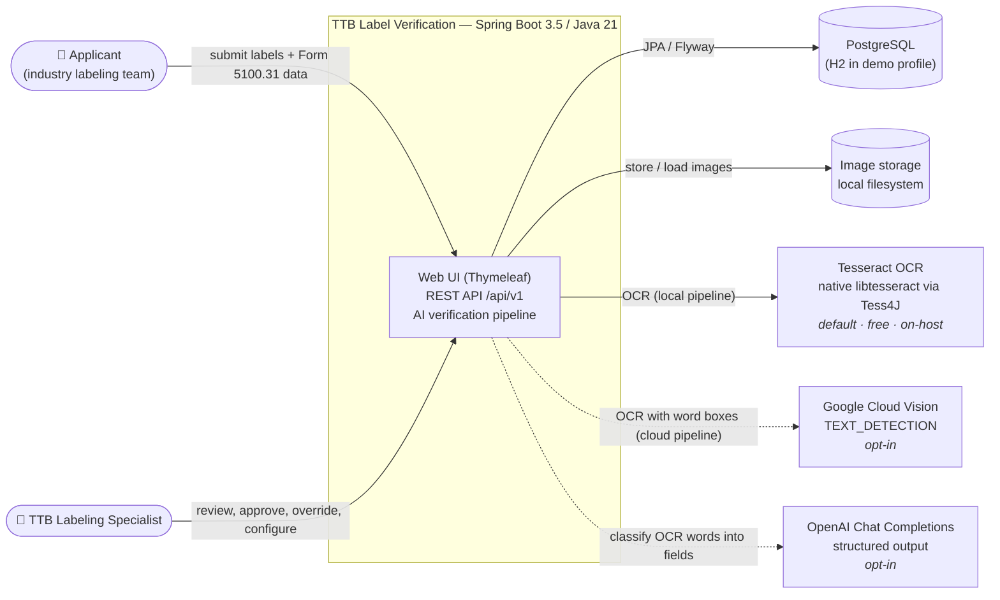
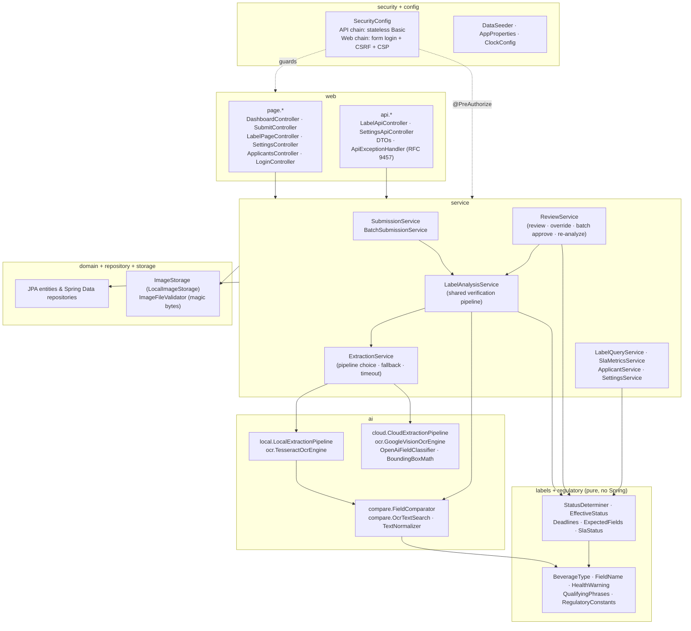
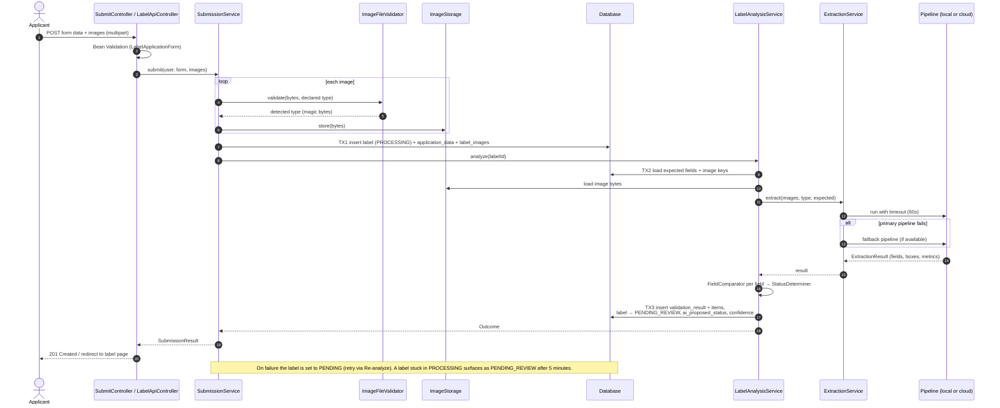
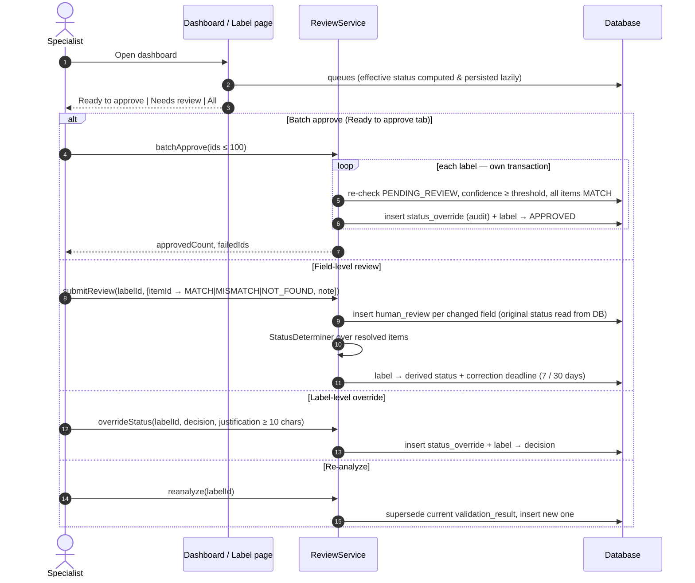
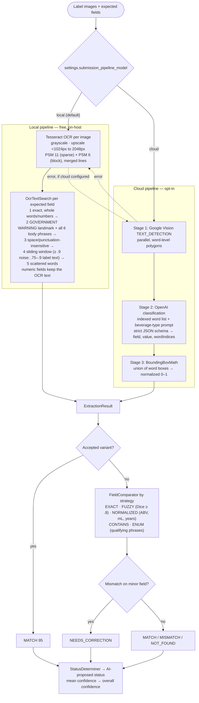
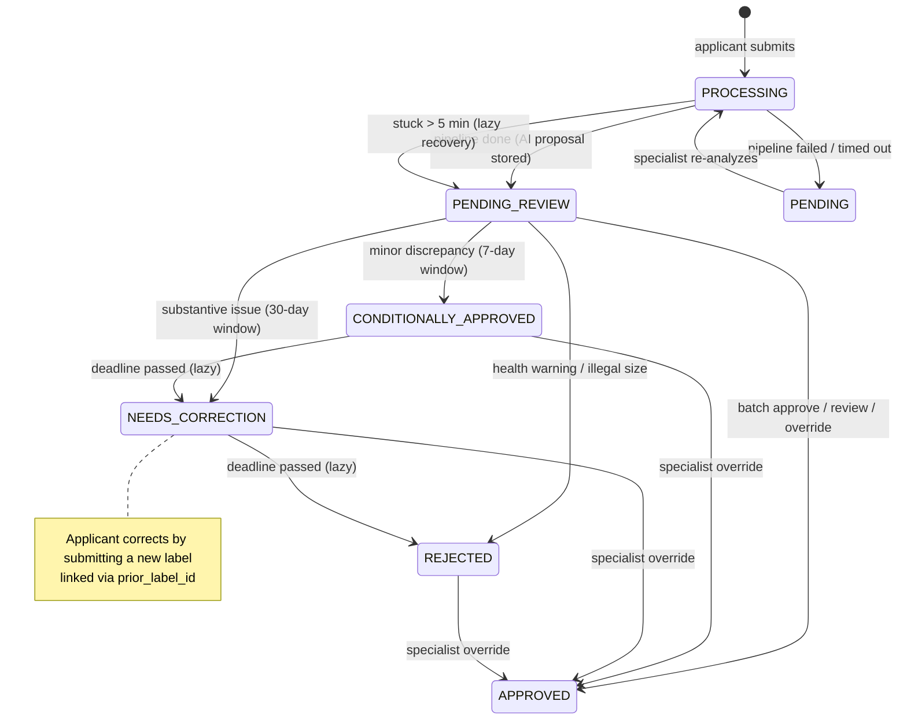
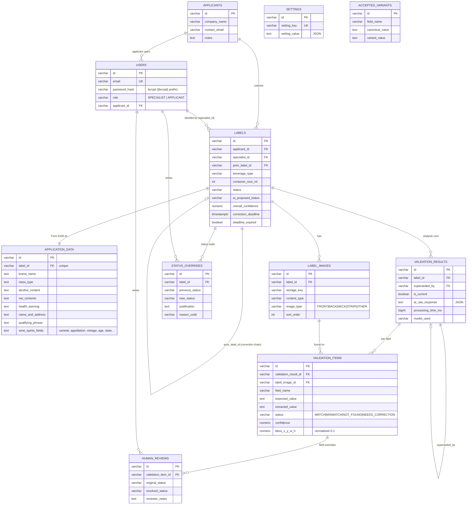
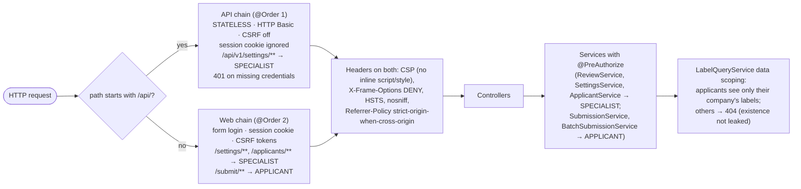

# Architecture

How TTB Label Verification is structured internally: who uses it, how a label moves through the system, how data is stored, and how it is secured. Deployment and networking are in [infrastructure.md](infrastructure.md), and the reasoning behind each choice is in the [ADRs](adr/README.md).

All diagrams are Mermaid, with sources in [diagrams/](diagrams/).

## Contents

1. [System context](#1-system-context)
2. [Components](#2-components)
3. [Submission flow](#3-submission-flow)
4. [Review flow](#4-review-flow)
5. [AI pipeline](#5-ai-pipeline)
6. [Label status lifecycle](#6-label-status-lifecycle)
7. [Data model](#7-data-model)
8. [Security model](#8-security-model)
9. [Cross-cutting concerns](#9-cross-cutting-concerns)

---

## 1. System context

Source: [diagrams/01-system-context.mmd](diagrams/01-system-context.mmd)

| Actor / system | Interaction |
|----------------|-------------|
| Applicant | Submits labels (form, API, CSV batch); sees only their company's labels |
| Specialist | Works the queues, reviews fields, sets final status, configures settings |
| PostgreSQL | System of record; schema owned by Flyway |
| Image storage | Uploaded label images, behind the `ImageStorage` interface |
| Tesseract | Default OCR engine; native library loaded through Tess4J (JNA) |
| Google Vision / OpenAI | Optional cloud pipeline; used only when both keys are configured |

## 2. Components

The application is a modular monolith ([ADR-0002](adr/0002-modular-monolith-with-pure-rule-packages.md)). `regulatory`, `labels` and `ai.compare` are plain Java with no framework imports.

Source: [diagrams/02-components.mmd](diagrams/02-components.mmd)

| Package (`gov.ttb.labelverification.*`) | Responsibility |
|-----------------------------------------|----------------|
| `regulatory` | TTB rules as data: mandatory fields per beverage type, standards of fill, health-warning text, qualifying phrases |
| `labels` | Verdict derivation, lazy status recovery, deadlines, SLA status |
| `ai.compare` | Field comparison engine and OCR text search |
| `ai.prefill` | Rule-based extraction of form values from OCR lines (pre-fill) |
| `ai.local`, `ai.cloud`, `ai.ocr` | Extraction pipelines and OCR engines |
| `service` | Use cases, transaction boundaries, method security |
| `web.page`, `web.api` | Thymeleaf controllers; REST controllers and DTOs |
| `domain`, `repository`, `storage` | JPA entities, Spring Data repositories, image storage and validation |
| `config`, `security` | Filter chains, typed properties, bootstrap seeding, principal |

## 3. Submission flow

Source: [diagrams/03-submission-sequence.mmd](diagrams/03-submission-sequence.mmd)

The AI call never runs inside a database transaction ([ADR-0009](adr/0009-database-transactions-never-wrap-ai-calls.md)).

| Failure | Result |
|---------|--------|
| Invalid image (type, size, magic bytes) | 422; nothing persisted |
| Validation error | 400 (API) / form re-rendered with messages (UI) |
| Selected pipeline fails | Other pipeline tried if available ([ADR-0010](adr/0010-pipeline-fallback-in-both-directions-not-on-timeout.md)) |
| Both fail, or timeout (60 s) | Label saved `PENDING`; specialist can re-analyze |
| Process crash mid-analysis | Label shown as `PENDING_REVIEW` after 5 minutes |

## 4. Review flow

Source: [diagrams/04-review-sequence.mmd](diagrams/04-review-sequence.mmd)

- **Ready to approve** means `PENDING_REVIEW`, an AI proposal of `APPROVED`, confidence at or above the threshold, and every field `MATCH`. Batch approval re-checks all of this on the server, one transaction per label.
- **Field review** records the original status from the database, not from the request ([ADR-0013](adr/0013-append-only-audit-trail-with-server-derived-history.md)).

## 5. AI pipeline

Source: [diagrams/05-ai-pipeline.mmd](diagrams/05-ai-pipeline.mmd)

Details are in [ai-pipelines.md](ai-pipelines.md).

## 6. Label status lifecycle

Source: [diagrams/06-label-status.mmd](diagrams/06-label-status.mmd)

Status is stored, but users see the **effective** status, which is computed on read and persisted when it differs ([ADR-0011](adr/0011-lazy-status-recovery-instead-of-a-scheduler.md)).

## 7. Data model

Source: [diagrams/07-erd.mmd](diagrams/07-erd.mmd)

- IDs are 21-character URL-safe random strings (`domain/Ids.java`).
- The schema is portable between PostgreSQL and H2 ([ADR-0005](adr/0005-portable-sql-schema-for-postgresql-and-h2.md)).
- `validation_results` keep a history: re-analysis supersedes the current result and never deletes it.
- `human_reviews` and `status_overrides` are append-only.
- `labels.prior_label_id` links a correction to the label it corrects.

## 8. Security model

Source: [diagrams/08-security.mmd](diagrams/08-security.mmd)

| Layer | Mechanism |
|-------|-----------|
| Authentication | Form login + session (UI); stateless HTTP Basic (API) ([ADR-0006](adr/0006-separate-security-filter-chains-for-api-and-ui.md)). Passwords are hashed with bcrypt. Sessions are stored in the database, so they survive restarts ([ADR-0019](adr/0019-http-sessions-stored-in-the-database.md)). Optional demo mode (`APP_DEMO_LOGIN`) adds a passwordless account picker to the login page. |
| Authorization | Route rules, `@PreAuthorize` on services, and data scoping, with 404 for other companies' resources ([ADR-0007](adr/0007-authorization-at-route-method-and-data-layers.md)) |
| CSRF | Tokens on every UI form; the API chain never reads cookies |
| Input | Bean Validation; image type, size and magic-byte checks; path-traversal-safe storage keys |
| Output | Strict CSP with no inline script or style; no stack traces in responses |
| Credentials | None in code, configuration defaults or docs ([ADR-0014](adr/0014-no-credentials-in-code-configuration-defaults-or-documentation.md)) |
| Confidentiality of scoring | Applicants see field statuses, but not AI confidence or reasoning |

## 9. Cross-cutting concerns

| Concern | Approach |
|---------|----------|
| Time | Injected `Clock`; tests run on fixed time |
| Concurrency | Virtual threads for pipeline timeout and parallel cloud OCR; a new Tesseract instance per pass |
| Configuration | `AppProperties` (`app.*`) for deployment settings; the `settings` table for runtime settings |
| Errors | RFC 9457 `ProblemDetail` for the API; friendly error page for the UI |
| Observability | Actuator health and info; structured logs for pipeline fallbacks and failures |
| Auditability | Raw pipeline output, model, timings and tokens stored for every analysis run |
