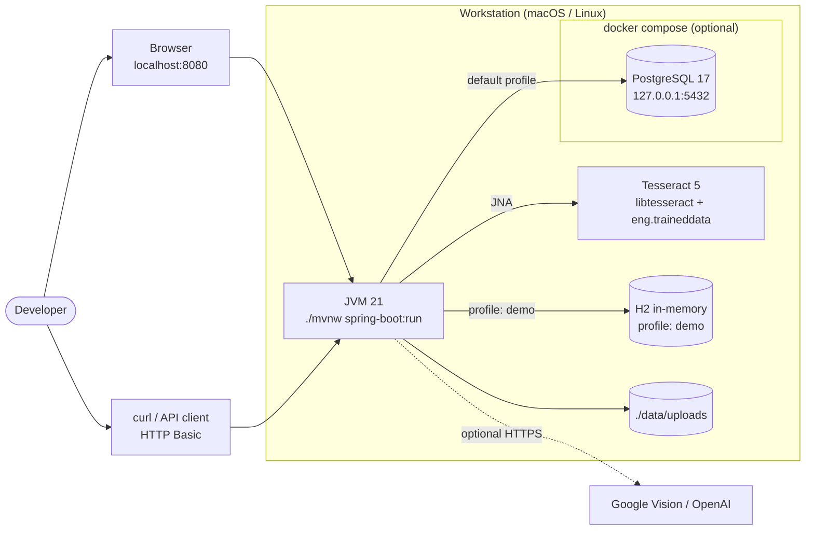
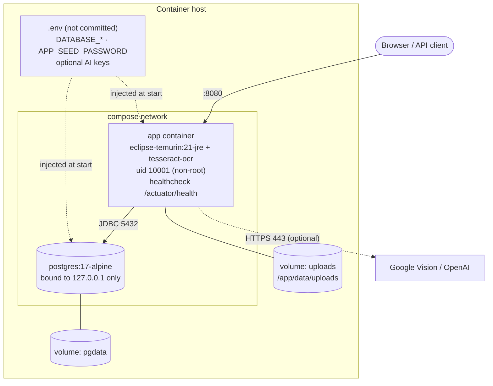
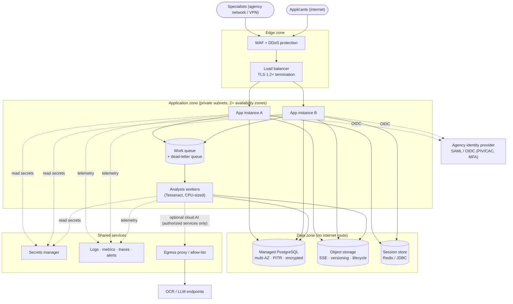
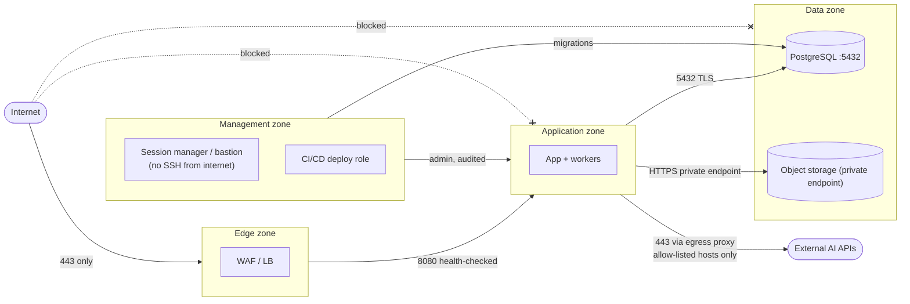
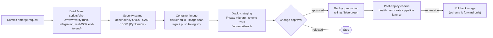
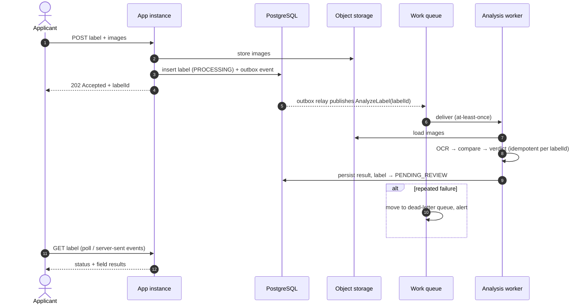

# Infrastructure

Where TTB Label Verification runs, from a developer laptop to a production deployment, and how the network, secrets and delivery pipeline are arranged. For the application's internal design see [architecture.md](architecture.md).

## Contents

1. [Local development](#1-local-development)
2. [Container topology](#2-container-topology)
3. [Production reference topology](#3-production-reference-topology)
4. [Network zones](#4-network-zones)
5. [CI/CD pipeline](#5-cicd-pipeline)
6. [Scaling target](#6-scaling-target)
7. [Configuration and secrets](#7-configuration-and-secrets)
8. [Sizing guidance](#8-sizing-guidance)
9. [Platform-as-a-service hosting](#9-platform-as-a-service-hosting)

---

## 1. Local development



<sub>Source: [diagrams/09-infra-local.mmd](diagrams/09-infra-local.mmd)</sub>


| Mode | Command | Database | Notes |
|------|---------|----------|-------|
| Demo | `./mvnw spring-boot:run -Dspring-boot.run.profiles=demo` | H2 in memory | Nothing to install except Java 21 and Tesseract; data is lost on restart |
| Standard | `docker compose up -d postgres` then `./mvnw spring-boot:run` | PostgreSQL 17 | Requires `DATABASE_USERNAME` / `DATABASE_PASSWORD` in `.env` |

Tesseract library and language-data paths are auto-detected for Homebrew (`/opt/homebrew`), `/usr/local`, and Debian/Ubuntu packages, or set with `TESSERACT_LIBRARY_PATH` / `TESSDATA_PREFIX`.

## 2. Container topology



<sub>Source: [diagrams/10-infra-container.mmd](diagrams/10-infra-container.mmd)</sub>


The `Dockerfile` is a two-stage build: Maven builds the jar, then it's copied onto `eclipse-temurin:21-jre` with `tesseract-ocr` installed. Hardening:

- The app runs as a non-root user (uid 10001).
- `HEALTHCHECK` polls `/actuator/health`.
- JVM heap is capped at 75% of the container memory (`-XX:MaxRAMPercentage=75`).
- PostgreSQL is published on `127.0.0.1` only.
- Credentials come from `.env` and are never baked into the image. `docker compose` refuses to start without them.

```bash
docker compose --profile app up --build
```

## 3. Production reference topology

A cloud-neutral layout. It maps directly onto AWS (GovCloud), Azure Government, or an on-premises Kubernetes cluster.



<sub>Source: [diagrams/11-infra-production.mmd](diagrams/11-infra-production.mmd)</sub>


| Component | Purpose | Examples |
|-----------|---------|----------|
| WAF + load balancer | TLS termination, OWASP rule set, rate limiting | AWS WAF + ALB, Azure Front Door + App Gateway, F5 |
| App instances (≥ 2, multi-AZ) | Web UI + REST API; stateless apart from the session store | ECS/EKS, AKS, OpenShift |
| Analysis workers | CPU-bound OCR, scaled on queue depth | Same image, worker profile |
| Work queue + DLQ | Decouples submission from analysis ([§6](#6-scaling-target)) | SQS, Azure Service Bus, RabbitMQ |
| Managed PostgreSQL | System of record; multi-AZ, point-in-time recovery, encryption at rest | RDS/Aurora, Azure Database for PostgreSQL |
| Object storage | Label images; server-side encryption, versioning, retention lifecycle | S3, Azure Blob — implement `ImageStorage` |
| Session store | Shared HTTP sessions across instances | Spring Session + Redis or JDBC |
| Identity provider | SAML/OIDC with PIV/CAC and MFA | Agency IdP, Login.gov |
| Secrets manager | Database and API credentials, rotated | AWS Secrets Manager, Azure Key Vault, Vault |
| Observability | Logs, metrics (Micrometer), traces, alerting | CloudWatch, Azure Monitor, Prometheus/Grafana, Splunk |
| Egress proxy | Allow-listed outbound access to authorized AI endpoints only | NAT + proxy, Azure Firewall |

## 4. Network zones

Deny by default; only the flows shown are allowed.



<sub>Source: [diagrams/12-network-zones.mmd](diagrams/12-network-zones.mmd)</sub>


| From → To | Port / protocol | Purpose |
|-----------|-----------------|---------|
| Internet → Edge | 443 TLS | Users and API clients |
| Edge → Application | 8080 HTTP (private) | Load-balanced traffic, health checks |
| Application → Data | 5432 TLS | PostgreSQL |
| Application → Object storage | HTTPS private endpoint | Label images |
| Application → Egress proxy → AI APIs | 443 TLS | Optional cloud pipeline; allow-listed hosts |
| Management → Application / Data | Audited sessions | Operations, migrations |

The data zone has no route to or from the internet.

## 5. CI/CD pipeline



<sub>Source: [diagrams/13-cicd-pipeline.mmd](diagrams/13-cicd-pipeline.mmd)</sub>


`scripts/ci.sh` is the single, vendor-neutral build entry point. Any CI system (Jenkins, GitLab CI, Azure DevOps, TeamCity, Bamboo) runs it on an agent with Java 21, Tesseract and Docker:

```bash
./scripts/ci.sh
```

Steps to add around it in the CI system:

- Dependency CVE scanning (OWASP Dependency-Check / Grype) and SAST.
- SBOM generation (CycloneDX Maven plugin).
- Image scanning and signing.
- Flyway migration as its own deploy step, before new instances start.
- Smoke tests against `/actuator/health` and a synthetic label submission.

Migrations are forward-only, so rollback means redeploying the previous image against a backward-compatible schema.

## 6. Scaling target

Analysis currently runs inside the submit request ([ADR-0008](adr/0008-synchronous-analysis-with-timeout-queue-based-evolution.md)). At higher volume, move it to workers:



<sub>Source: [diagrams/14-scaling-target.mmd](diagrams/14-scaling-target.mmd)</sub>


- A transactional **outbox** guarantees an analysis event for every stored label.
- Workers are **idempotent** per label ID (at-least-once delivery), and failures go to a dead-letter queue with alerting.
- The label page polls, or uses server-sent events, until the status leaves `PROCESSING`. The existing lazy recovery ([ADR-0011](adr/0011-lazy-status-recovery-instead-of-a-scheduler.md)) remains the safety net.

## 7. Configuration and secrets

| Setting | Source | Secret? |
|---------|--------|---------|
| `DATABASE_URL`, `DATABASE_USERNAME`, `DATABASE_PASSWORD` | Secrets manager → environment | Yes (password) |
| `APP_SEED`, `APP_SEED_PASSWORD` | Environment. Set `APP_SEED=false` in production | Yes (password) |
| `GOOGLE_VISION_API_KEY`, `OPENAI_API_KEY` | Secrets manager → environment | Yes |
| `OPENAI_MODEL`, `OPENAI_BASE_URL` | Environment | No |
| `TESSDATA_PREFIX`, `TESSERACT_LIBRARY_PATH` | Image / environment | No |
| `APP_STORAGE_DIR` | Environment (volume mount) | No |
| Pipeline choice, approval threshold, SLA targets | `settings` table, edited by specialists | No |

No credential has a default value in code or configuration files ([ADR-0014](adr/0014-no-credentials-in-code-configuration-defaults-or-documentation.md)).

## 8. Sizing guidance

Starting points. Analysis time was measured locally on the synthetic 1600×2000 px labels; the other values are estimates to confirm with load testing.

| Resource | Guidance |
|----------|----------|
| Local analysis (measured) | About 0.5–0.8 s per single-image label; scale workers by CPU cores |
| Memory (estimate) | 1 GB heap handles concurrent uploads of 10 MB images; add about 200 MB per concurrent OCR |
| Database (estimate) | Small: about 10 rows per label plus audit rows; images live outside the database |
| Storage (estimate) | About 150 KB–10 MB per image; apply a retention lifecycle |

## 9. Platform-as-a-service hosting

For small deployments, the app runs on a PaaS with two services: the app container and managed PostgreSQL. The `railway` profile and the Dockerfile's JVM defaults fit a 512 MB container, with a measured peak of 402 MB under 8 concurrent submissions. Images can be stored in PostgreSQL when only one volume is available ([ADR-0018](adr/0018-small-container-profile-for-paas-hosting.md)).

Step-by-step guide: [deploy-railway.md](deploy-railway.md). The same profile works on other platforms that terminate TLS and inject a `postgres://` database URL.
